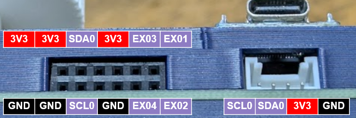

# keyboards

This repository was created to manage the circuitry and firmware for the keyboards I designed.  
The firmware is created using [sago35/tinygo-keyboard](https://github.com/sago35/tinygo-keyboard).  

## sg24

* [kicanvas](https://kicanvas.org/?github=https%3A%2F%2Fgithub.com%2Fsago35%2Fkeyboards%2Ftree%2Fmain%2Fsg24%2Fsg24)

## zero-kb02/

* [kicanvas](https://kicanvas.org/?github=https%3A%2F%2Fgithub.com%2Fsago35%2Fkeyboards%2Ftree%2Fmain%2Fzero-kb02%2Fzero-kb02)
* workshop - https://github.com/sago35/tinygo_keeb_workshop_2024

### pinout

