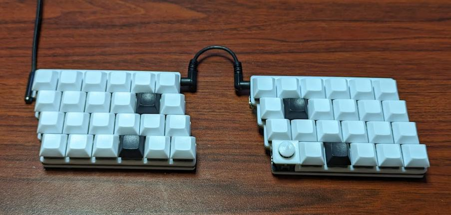
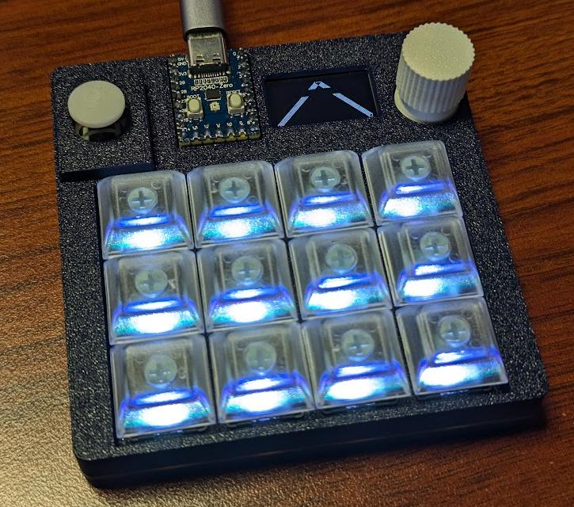
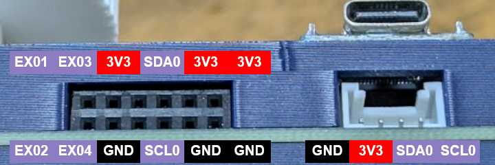
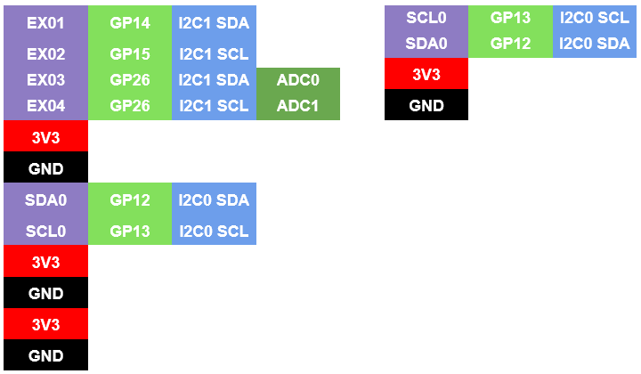
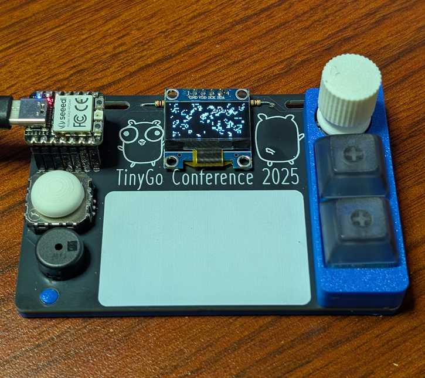

# keyboards

This repository was created to manage the circuitry and firmware for the keyboards I designed.  
The firmware is created using [sago35/tinygo-keyboard](https://github.com/sago35/tinygo-keyboard).  

## sg24

* [kicanvas](https://kicanvas.org/?github=https%3A%2F%2Fgithub.com%2Fsago35%2Fkeyboards%2Ftree%2Fmain%2Fsg24%2Fsg24)

## zero-kb02/

* [kicanvas](https://kicanvas.org/?github=https%3A%2F%2Fgithub.com%2Fsago35%2Fkeyboards%2Ftree%2Fmain%2Fzero-kb02%2Fzero-kb02)
* [gerber data for jlcpcb](./zero-kb02/zero-kb02/GERBER-zero-kb02.zip)
    * For the `Mark on PCB` item, please select `Order Number(Specify Position)`
* [case (stl / 3mf)](./zero-kb02/stl/)
* workshop - https://github.com/sago35/tinygo_keeb_workshop_2024

### pinout

| Name      | Pin            | Info
|-----------|----------------|------
| VR\_BTN   | machine.GPIO0  | InputPullup
| WS2812    | machine.GPIO1  | Output
| ROT\_BTN1 | machine.GPIO2  | InputPullup
| ROT\_A1   | machine.GPIO3  | InputPullup
| ROT\_B1   | machine.GPIO4  | InputPullup
| COL1      | machine.GPIO5  | Output
| COL2      | machine.GPIO6  | Output
| COL3      | machine.GPIO7  | Output
| COL4      | machine.GPIO8  | Output
| ROW1      | machine.GPIO9  | InputPulldown
| ROW2      | machine.GPIO10 | InputPulldown
| ROW3      | machine.GPIO11 | InputPulldown
| SDA0\_TX0 | machine.GPIO12 | I2C SDA
| SCL0\_RX0 | machine.GPIO13 | I2C SCL
| EX01      | machine.GPIO14 | GPIO
| EX02      | machine.GPIO15 | GPIO
| EX03      | machine.GPIO26 | GPIO / ADC
| EX04      | machine.GPIO27 | GPIO / ADC
| VR\_Y     | machine.GPIO28 | ADC
| VR\_X     | machine.GPIO29 | ADC

### matrix and leds

The image below represents the relationship between the COL and ROW of the MATRIX wiring, as well as the order of the LEDs.
It was created by [rdon_key](https://x.com/rdon_key).

## sg48key2

* [kicanvas](https://kicanvas.org/?github=https%3A%2F%2Fgithub.com%2Fsago35%2Fkeyboards%2Ftree%2Fmain%2Fsg48key2%2Fsg48key2)
  * Configuration of U3 is incorrect and needs to be fixed.

## conf2025badge

This is the badge for TinyGo Conference 2025 in JAPAN.

* [kicanvas](https://kicanvas.org/?github=https%3A%2F%2Fgithub.com%2Fsago35%2Fkeyboards%2Ftree%2Fmain%2Fconf2025badge%2Fconf2025badge)
* [case (stl / 3mf)](./conf2025badge/stl/)

| No | 品名 | 個数 | 備考 |
|---|---|---|---|
| 1 | 基板 | 1 | |
| 2 | [XIAO RP2040](https://akizukidenshi.com/catalog/g/g117044/) | 1 | |
| 3 | [ジョイスティック](https://akizukidenshi.com/catalog/g/g104048/) | 1 | |
| 4 | [OLED 液晶](https://akizukidenshi.com/catalog/g/g112031/) | 1 | SSD1306 128x64 |
| 5 | [プルアップ抵抗](https://akizukidenshi.com/catalog/g/g116332/) | 2 | 3.3K (1K – 10K) |
| 6 | [キースイッチ](https://shop.yushakobo.jp/collections/all-switches) | 2 | |
| 7 | [キーキャップ](https://shop.yushakobo.jp/collections/keycaps?sort_by=created-descending&filter.v.availability=1&filter.v.price.gte=&filter.v.price.lte=) | 2 | |
| 8 | [キーソケット](https://shop.yushakobo.jp/products/a01ps?variant=37665172521121) | 2 | MX socket |
| 9 | ロータリーエンコーダー | 1 | EC11 互換、20mm Plum |
| 10 | [RGB LED](https://akizukidenshi.com/catalog/g/g115478/) | 2 | SK6812MINI-E |
| 11 | [ブザー](https://akizukidenshi.com/catalog/g/g104118/) | 1 | |
| 12 | エンコーダーノブ | 1 | |
| 13 | ハット | 1 | ジョイスティック用 |
| 14 | スイッチプレート | 1 | |
| 15 | ボトムプレート | 1 | |
| 16 | 木ねじ 2.1×10 | 2 | |
