## gocon2026バッジのビルドガイド

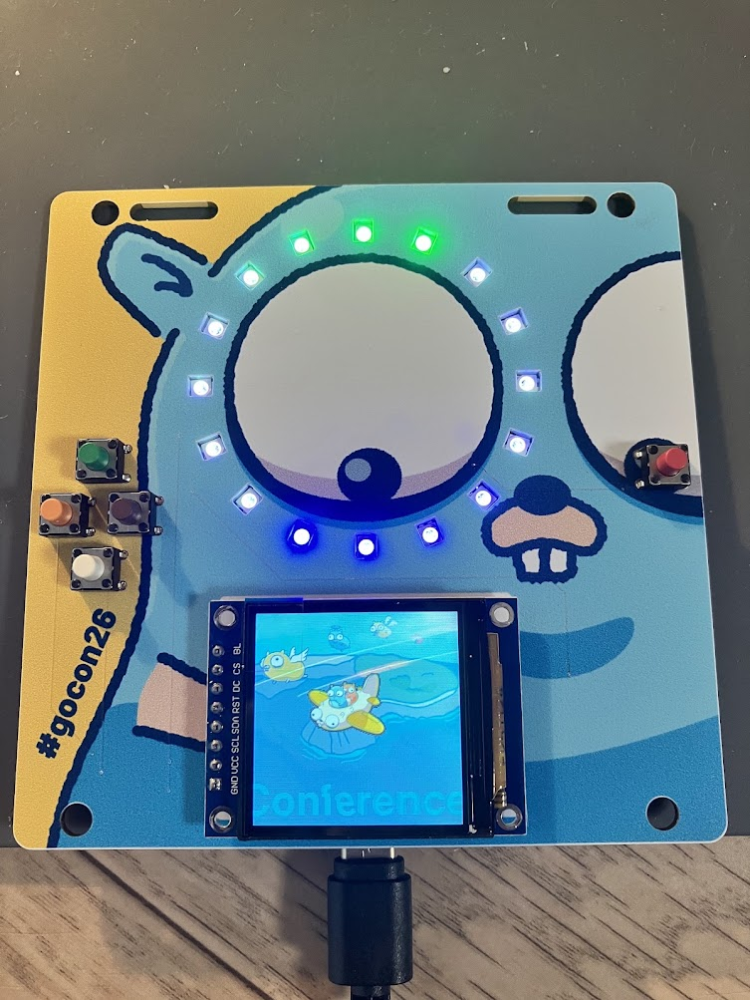

このドキュメントではGo Conference 2026で配布された基板の組み立て方を説明します。  
必要なパーツは以下に記載しますが、はんだごてなど組み立てに必要な道具はご自分で用意してください。

### パーツ

組み立てには以下の部品が必要になります。

- waveshare rp2040 zero  
https://shop.talpkeyboard.com/products/rp2040-zero-usb-c-compatible

- sk6812 x 16 (追記: 5個入なので以下を商品を4つ購入してください)  
https://akizukidenshi.com/catalog/g/g115478/

- st7779 240x240  
https://akizukidenshi.com/catalog/g/g131019/

- タクトスイッチ x 5   
https://akizukidenshi.com/catalog/g/g103647/

### 組み立て

最初はLEDを付けます。基板を裏返して表面実装のSK6812をはんだ付けします。
SK6812には向きがあります。  
LEDを見ると斜め45度に切れているのがわかります。

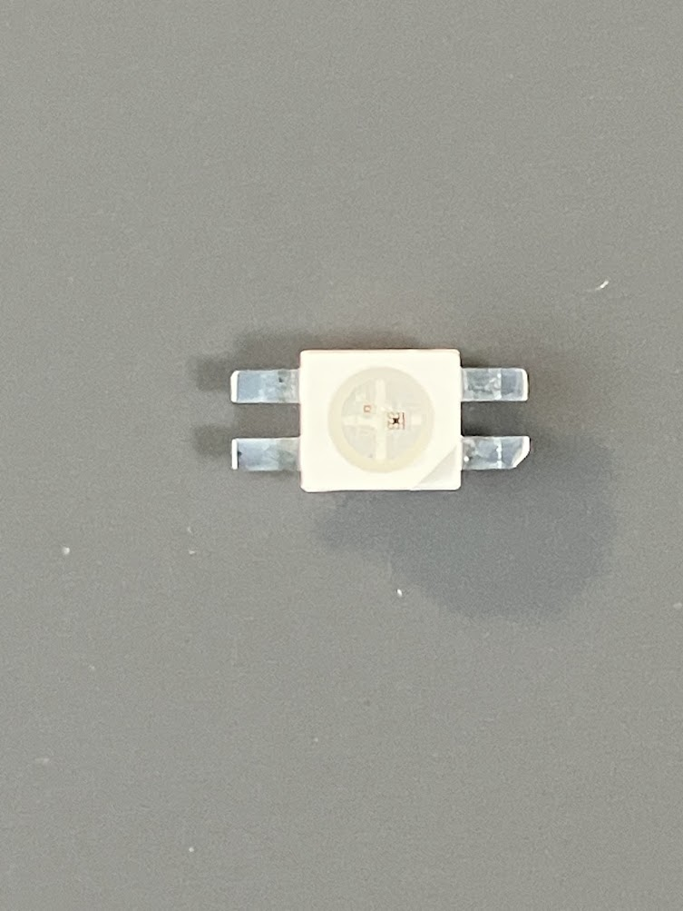

裏返した基板を見ると黒い線でL字が入っている箇所があります。  
この黒いLと斜め45度に切れているLEDの足を合わせるようにして置いてください。

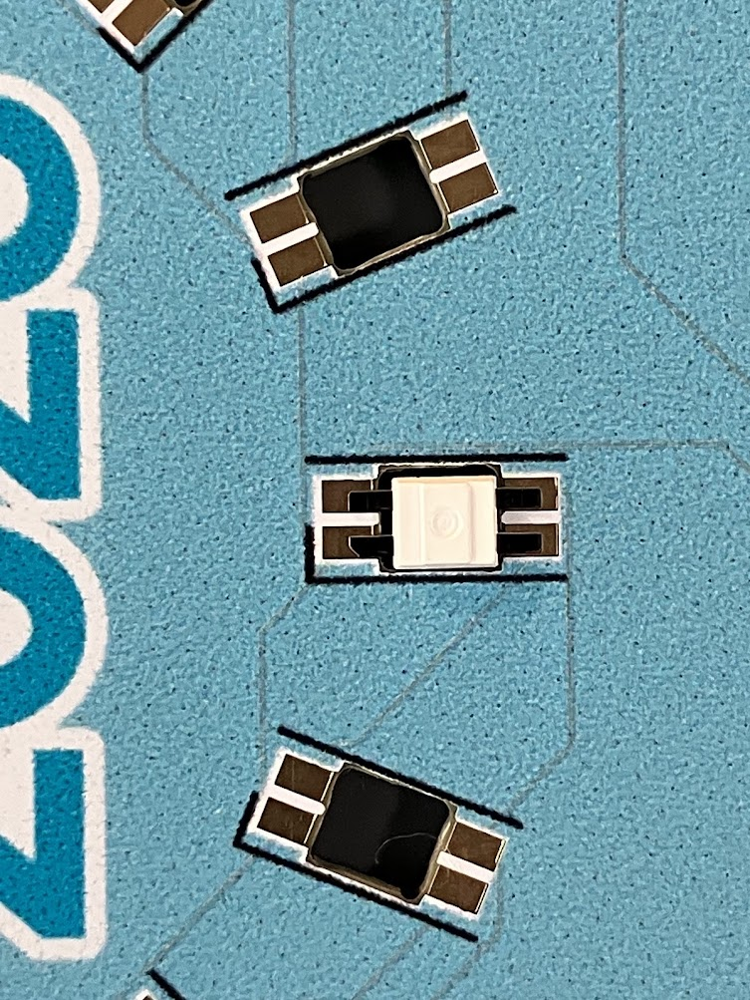

LEDを向きの沿って並べた写真です。  
1つでも向きを間違うとLEDが光らないので、はんだ付けをする前によく確認してください。

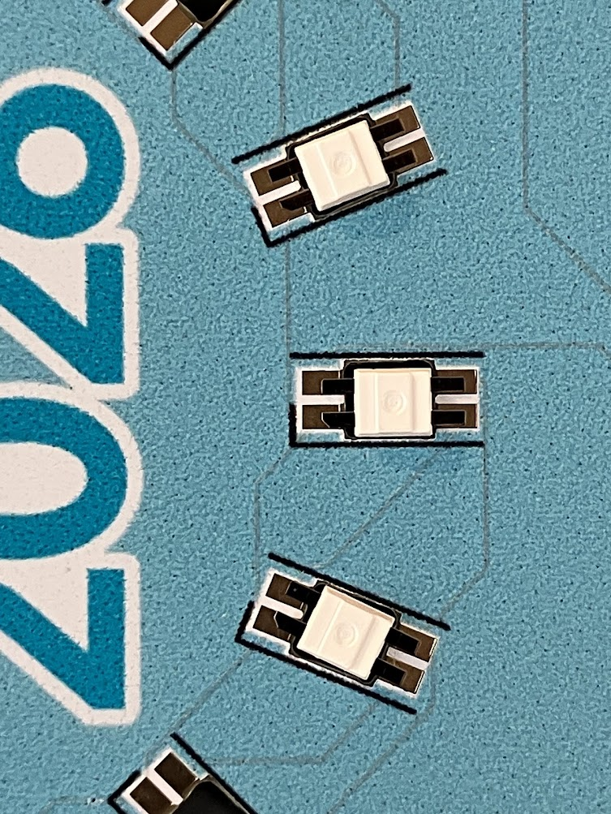

正しく向きでLEDを並べたらはんだ付けをしていきます。

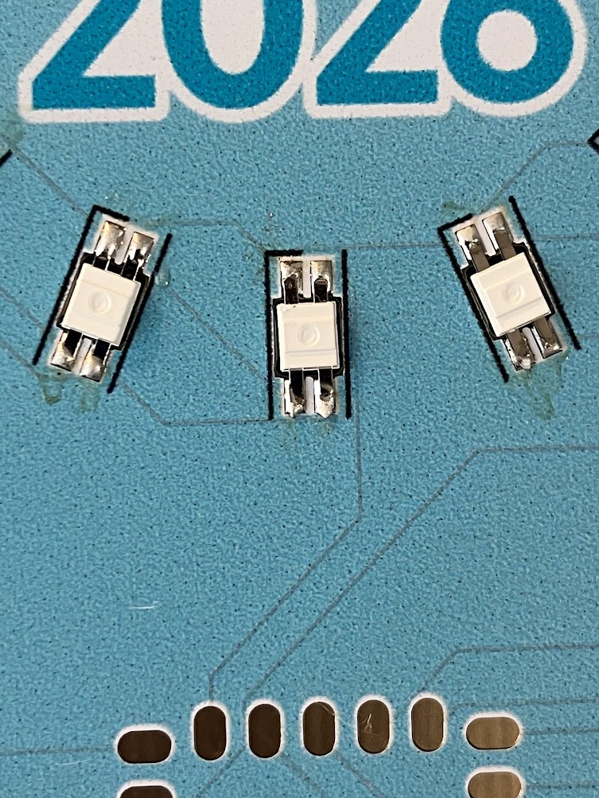

Tipsとして必須ではありませんが、予備はんだをしてLEDをはんだ付けするとうまくいくと思います。  

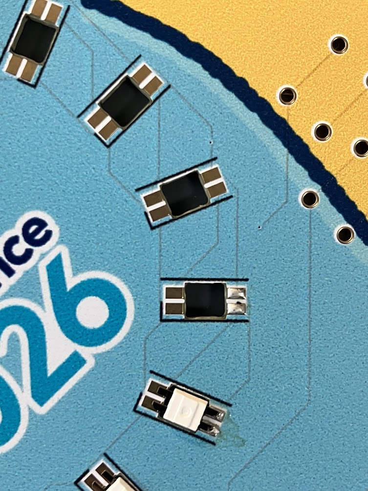

裏面に円状にLEDを16個はんだ付けしたらOKです。  
次に裏面にマイコンをはんだ付けします。

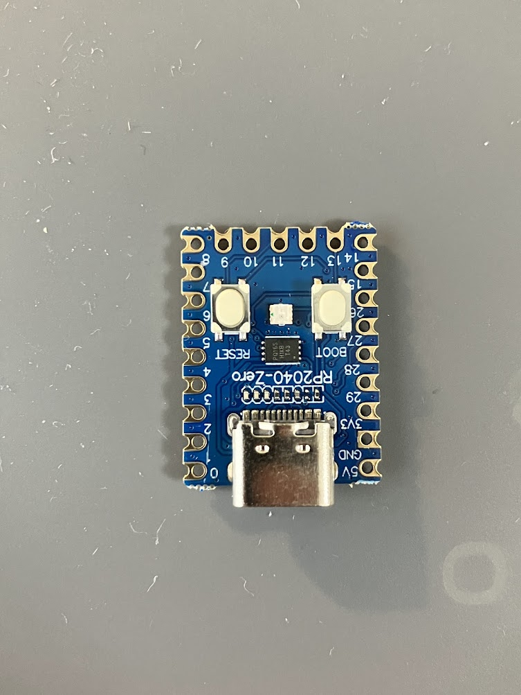

マイコンをテープで仮止めしたら、どこか角の箇所をはんだ付けして位置決めをしましょう。

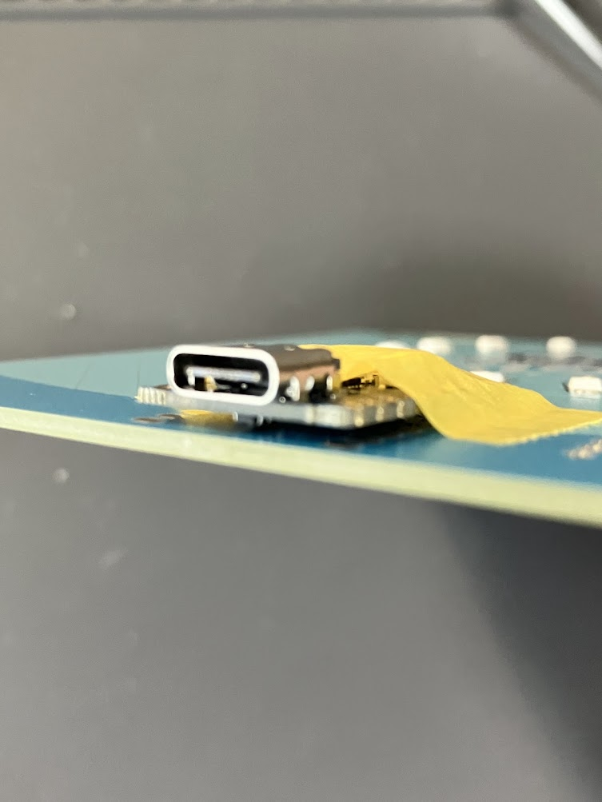

位置決めができたら残りの箇所をすべてはんだ付けしましょう。  

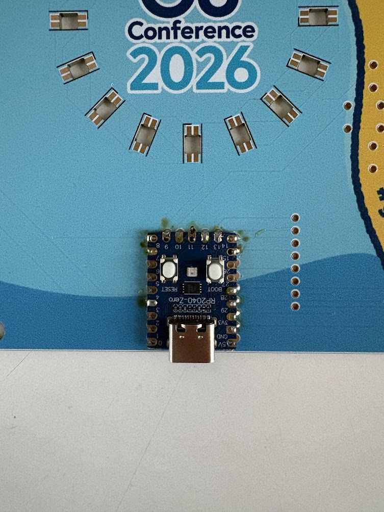

マイコンがはんだ付けできたらタクトスイッチを表面から差し込みます。

タクトスイッチを5つ表面から差し込んだら、裏面からはんだ付けします。  

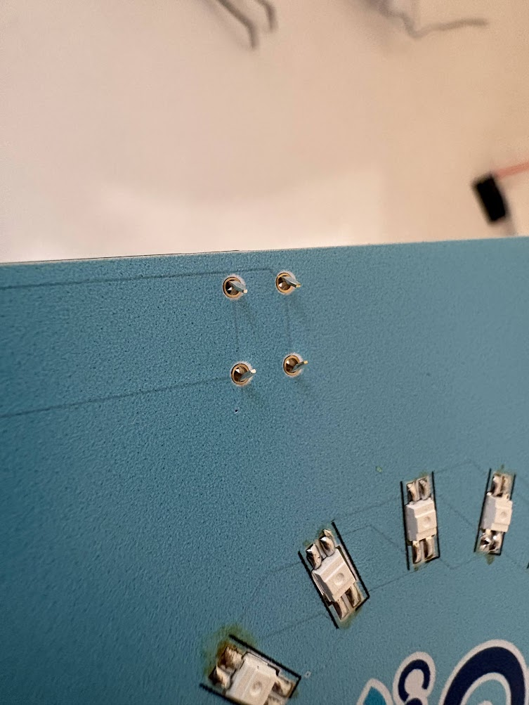

タクトスイッチをはんだ付けしたら液晶にピンヘッダーをはんだ付けします。  
ブレットボードなどに固定してはんだ付けすると作業しやすいでしょう。

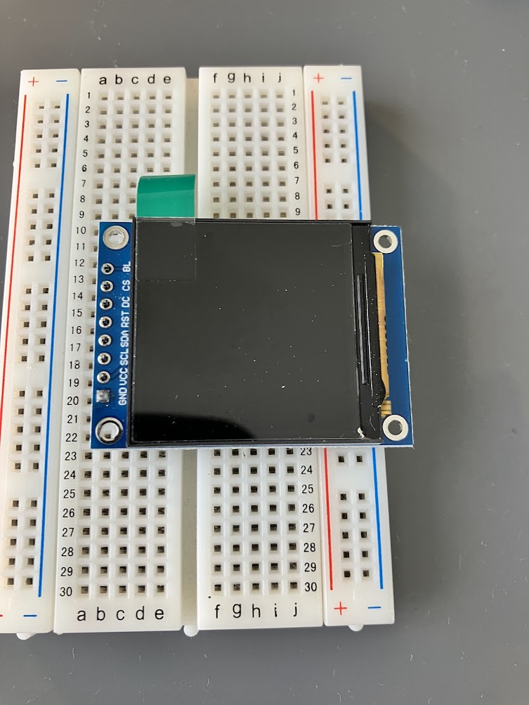

8箇所はんだ付けします。

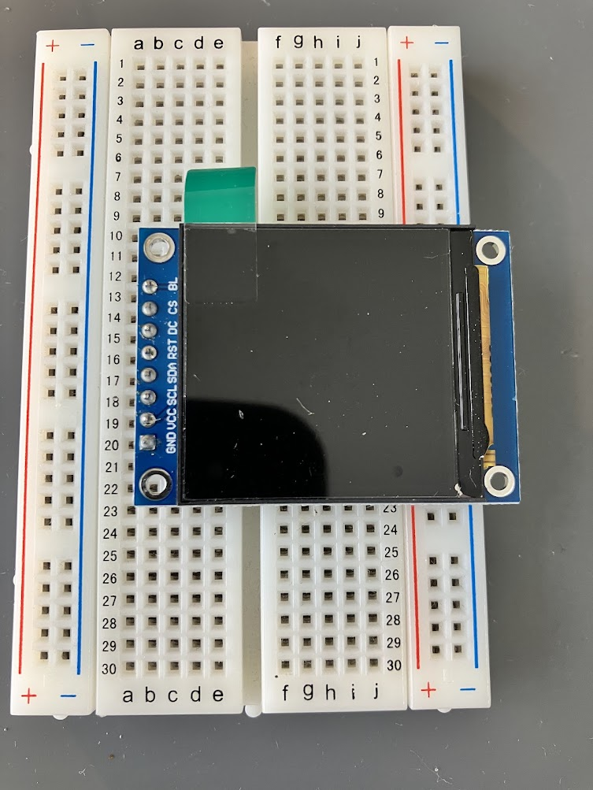

液晶画面にピンヘッダーをはんだ付けしたら、基板の表面に挿して、裏面からはんだ付けをします。  
裏面から8箇所はんだ付けしたら組み立て完了です。

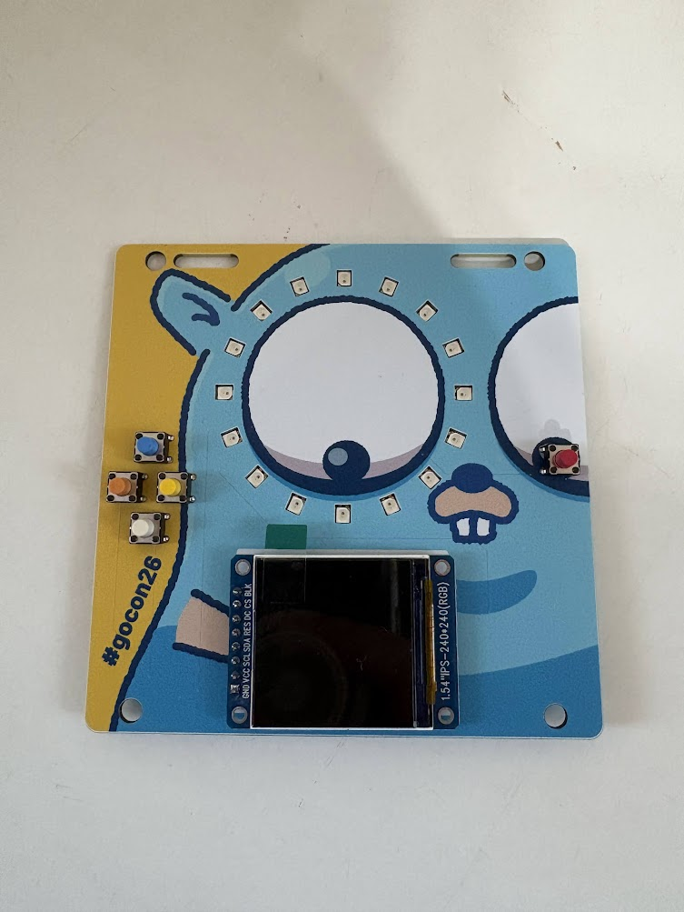

## ケース

TODO: ケースのURLを貼る